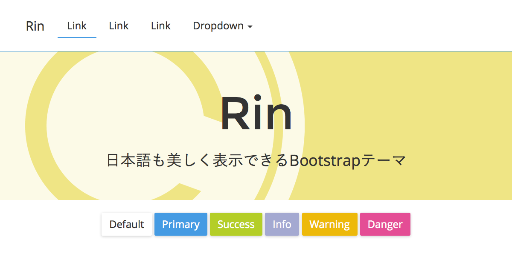

# Rin

[](https://travis-ci.org/raryosu/Rin)
[](https://ci.appveyor.com/project/raryosu/rin/branch/master)
[](https://david-dm.org/raryosu/Rin#info=devDependencies)
[](LICENSE)

[http://rinhoshizo.la/](http://rinhoshizo.la/)

[](http://rinhoshizo.la/)

"Rin" は "Honoka" を元にした日本語も美しく表示できるBootstrapテーマです。

## About "Rin"

通常の[Bootstrap](http://getbootstrap.com/)では，日本語のフォント指定や文字サイズは最適とはいえません。"Honoka"はそんなBootstrapをベースに，日本語表示に適したフォント指定や，文字サイズに関するコードを追記したBootstrapテーマの一つです。

## Live Demo

 * [http://rinhoshizo.la/bootstrap-ja.html](http://rinhoshizo.la/bootstrap-ja.html) (日本語レイアウト)
 * [http://rinhoshizo.la/bootstrap.html](http://rinhoshizo.la/bootstrap.html) (英語レイアウト)

## Getting Started

### Download

[Releases](https://github.com/raryosu/Rin/releases)から最新版をダウンロードしてください。

### Bower

[Bower](http://bower.io/)からインストールすることができます。

最新版をインストールするには以下のコマンドを実行してください。

```
bower install --save-dev $(node -e "$(curl -fsSL https://cdn.honokak.osaka/last.js)" raryosu Rin)
```

もしcURLが入っていない環境の場合には、

```
bower install --save-dev Rin#(version)
```

``(version)``にはバージョン番号を指定します(ex. ``Rin#3.3.6-3``)。Umiの最新バージョン番号は[Releases](https://github.com/raryosu/Rin/releases)から確認してください。

## Usage

Rinは単なるBootstrapテーマにしか過ぎないため，基本的な使い方は本家Bootstrapとほとんど変わりません。よって以下に書くことは[本家Bootstrap](http://getbootstrap.com/getting-started/)からの引用，もしくはその一部を変更したものです。用意されたCSSクラスやコンポーネントなど，より詳細な使い方のドキュメントは本家Bootstrapの各種リファレンスページをご覧になることを推奨します。

 * [CSS](http://getbootstrap.com/css/)
 * [Components](http://getbootstrap.com/components/)
 * [JavaScript](http://getbootstrap.com/javascript/)

### Package

配布しているzipファイルの内容物は以下のとおりです。``bootstrap.min.*``といったように，ファイル名に``min``がつくファイルは，改行やインデント・スペーシングをなくした(minifyされた)コードで，ユーザがウェブページを読み込む際の転送量を少なくすることができます。通常はこの``bootstrap.min.*``を使うことをおすすめします。

```
honoka/
├─ bootstrap.html
├─ css/
│   ├─ bootstrap.css
│   └─ bootstrap.min.css
├─ fonts/
│   ├─ glyphicons-halflings-regular.eot
│   ├─ glyphicons-halflings-regular.svg
│   ├─ glyphicons-halflings-regular.ttf
│   ├─ glyphicons-halflings-regular.woff
│   └─ glyphicons-halflings-regular.woff2
└─ js/
     ├─ bootstrap.js
     └─ bootstrap.min.js
```

### Basic Template

Bootstrapをつかってウェブページを作成する際に基本となるHTML部分は以下のようになります。CSSやJavaScriptのファイルパスは環境に合わせて変更する必要があります。

```html
<!DOCTYPE html>
<html lang="ja">
  <head>
    <meta charset="utf-8">
    <meta http-equiv="X-UA-Compatible" content="IE=edge">
    <meta name="viewport" content="width=device-width, initial-scale=1">
    <!-- The above 3 meta tags *must* come first in the head; any other head content must come *after* these tags -->
    <title>Bootstrap 101 Template</title>

    <!-- Bootstrap -->
    <link href="css/bootstrap.min.css" rel="stylesheet">

    <!-- HTML5 shim and Respond.js for IE8 support of HTML5 elements and media queries -->
    <!-- WARNING: Respond.js doesn't work if you view the page via file:// -->
    <!--[if lt IE 9]>
      <script src="https://oss.maxcdn.com/html5shiv/3.7.2/html5shiv.min.js"></script>
      <script src="https://oss.maxcdn.com/respond/1.4.2/respond.min.js"></script>
    <![endif]-->
  </head>
  <body>
    <h1>Hello, world!</h1>

    <!-- jQuery (necessary for Bootstrap's JavaScript plugins) -->
    <script src="https://ajax.googleapis.com/ajax/libs/jquery/1.11.2/jquery.min.js"></script>
    <!-- Include all compiled plugins (below), or include individual files as needed -->
    <script src="js/bootstrap.min.js"></script>
  </body>
</html>
```

### Do you hate "YuGothic"?

もしあなたが日本語フォントに游ゴシックを指定したくない場合，その要素に対して``.no-thank-yu``(※``you``ではなく``yu``)を指定することで游ゴシックの指定はされなくなり，Windowsであればメイリオ，Mac OS Xであればヒラギノ角ゴを優先的に使用するようになります。

例えばページ全体に対して游ゴシックを用いたくない場合は，``<body>``に対して``.no-thank-yu``を指定(``<body class="no-thank-yu">``)することで，ページ全体で游ゴシックは使用されなくなります。

## Build

ビルドの方法については [Wiki](https://github.com/windyakin/Honoka/wiki) をご覧ください。

## License

[MIT License](LICENSE)

## Author of "Honoka"

 * windyakin ([windyakin.net](http://windyakin.net/))

## Editor of "Rin"

 * Hagihara Ryosuke ([Raryosu.info](http://raryosu.info/))
